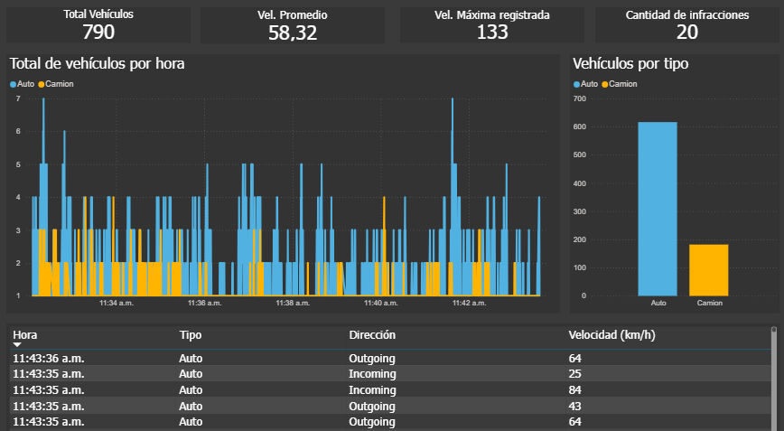
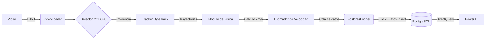

# TrafficVision — Proyecto Académico de Análisis de Tráfico


---

## 1. Descripción General

**TrafficVision** es un **prototipo académico** desarrollado con fines educativos para integrar conceptos de **Visión Artificial**, **procesamiento de video**, **cálculo físico** e **Ingeniería de Datos**.

El sistema simula un escenario real de monitoreo de tránsito: procesa un video, detecta y sigue vehículos mediante IA, estima su velocidad a partir de una transformación de perspectiva y persiste los resultados en una base de datos relacional para su análisis posterior en un tablero simple.

---

## 2. Demo y Resultados

| Detección y estimación de velocidad |           Dashboard en Power BI            |
| :---------------------------------: | :----------------------------------------: |
|         |  |
| _YOLOv8 + lógica propia de cálculo_ |   _Visualización de métricas históricas_   |

---

## 3. Arquitectura y Flujo de la Aplicación

Para mantener un procesamiento fluido, se implementó una arquitectura **multihilo tipo Producer–Consumer**, desacoplando el análisis de video de la persistencia en base de datos.



---

## 4. Guía de Ejecución

### Prerrequisitos

- Python **3.10** o superior
- Servidor **PostgreSQL** activo
- **Power BI Desktop** (opcional, solo para visualización)

### Instalación

1. Clonar el repositorio e instalar dependencias:

```bash
git clone https://github.com/TU_USUARIO/TrafficVision.git
cd TrafficVision
pip install -r requirements.txt
```

2. Configurar variables de entorno creando un archivo `.env`:

```env
DB_HOST=localhost
DB_NAME=traffic_db
DB_USER=postgres
DB_PASSWORD=tu_password
DB_PORT=5432
```

3. Cargar ubicacion del video en el archivo `main.py` y configurar el frame skipping:

```py
VIDEO_SOURCE = r"/RUTA DE VIDEO"

SKIP_FRAMES = n intervalo de frames que no van a ser procesados
```

4. Inicializar la base de datos ejecutando el script SQL:

```bash
psql -U postgres -d traffic_db -f sql/init_db.sql
```

5. Calibración

Para que el cálculo de velocidad sea realista, es necesario mapear la perspectiva de la cámara mediante una homografía:

```py
VIDEO_PATH = r"/Ruta del video"

REAL_WIDTH = #ancho estimada del área a calibrar en metros

REAL_LENGTH = #longitud estimada del área a calibrar en metros
```

```bash
python utils/calibration_tool.py
```

5. Ejecutar la aplicación:

```bash
python main.py
```

---

## 5. Estructura del Repositorio

La organización del código busca una clara separación de responsabilidades:

```
TrafficVision/
│
├── core/                   # Lógica principal
│   ├── detector.py         # Abstracción del modelo YOLOv8
│   ├── tracker.py          # Seguimiento de objetos (ByteTrack)
│   ├── speed_estimator.py  # Física + homografía
│   ├── postgres_logger.py  # Persistencia asíncrona en PostgreSQL
│   └── video_loader.py     # Lectura de video
│
├── utils/
│   └── calibration_tool.py # Calibración interactiva
│
├── config/
│   └── homography_matrix.npy
│
├── sql/
│   └── init_db.sql
│
├── main.py                 # Orquestador del sistema
└── README.md
```

---

## 6. Componentes Técnicos Destacados

- **main.py**: coordina los módulos, gestiona los hilos y asegura un cierre ordenado del sistema.

- **detector.py**: utiliza YOLOv8 preentrenado, filtrando únicamente clases relevantes (autos, camiones, motos).

- **tracker.py**: implementa ByteTrack para mantener la identidad de cada vehículo entre frames, evitando conteos duplicados y manejando oclusiones temporales.

- **speed_estimator.py**: aplica álgebra lineal mediante una **matriz de homografía** para transformar coordenadas 2D del video a un plano real en metros y calcular la velocidad real (v = d / t).

- **postgres_logger.py**: corre en un hilo independiente y realiza **batch inserts**, mejorando el rendimiento. Incluye lógica de particionamiento por fecha.

- **calibration_tool.py**: herramienta interactiva con OpenCV para seleccionar puntos de referencia sobre la calzada.

---

## 7. Aprendizajes Clave

Este proyecto permitió profundizar en:

- Arquitecturas concurrentes en Python
- Integración de modelos de visión artificial en sistemas reales
- Persistencia eficiente de grandes volúmenes de datos
- Transformaciones geométricas y cálculo físico aplicado
- Consumo de bases de datos desde herramientas de BI

---

## 8. Trabajo Futuro y Mejoras

Como proyecto académico, se identifican posibles extensiones para una versión 2.0:

- Mejora en el tablero de metricas
- Exposición de datos mediante una API REST
- Métricas avanzadas y alertas en tiempo real
- Evaluar algoritmos como BoT-SORT o DeepSORT que incorporan características visuales (Re-ID).

---

_Proyecto desarrollado con fines educativos. Autor: Serafini Oscar Augusto. fecha: 2025_
